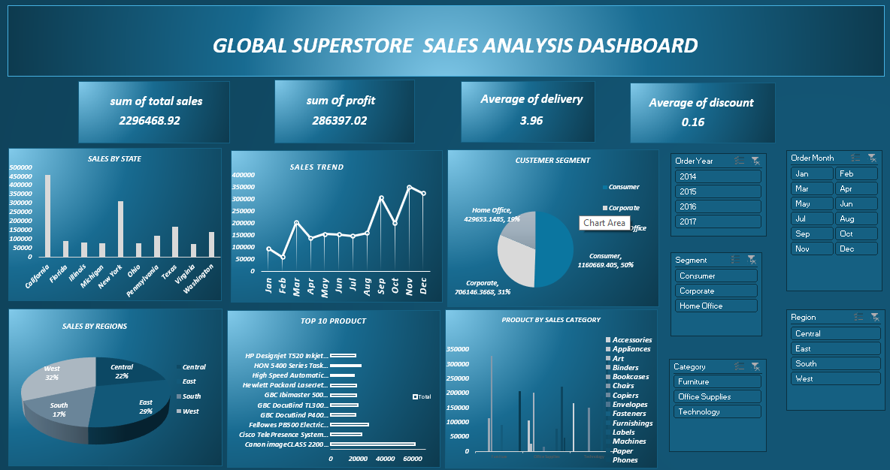

### Global Superstore Sales Analysis Dashboard 🌐📊

### 📌 Project Overview

Purpose: A dynamic, multi-dimensional Excel analytics dashboard built to monitor, analyze, and optimize international retail operations for a global superstore enterprise.

Scope: Consolidates corporate transactional records across multiple years (2014–2017) to provide high-level and granular visibility into global sales metrics, operational timelines, and product distributions.

Target Audience: Supply chain executives, regional sales managers, and business analysts seeking data-driven insights into corporate performance and market segmentation.

### 📊 Dashboard Preview

### 🎯 Key Objectives
Isolate Profitability Drivers: Track real-time correlations between gross revenue, operating discounts, and final profit margins to safeguard corporate bottom lines.

Enhance Supply Chain Visibility: Monitor global shipping performance to identify bottleneck areas and optimize standard distribution metrics.

Refine Customer Targeting: Evaluate transaction densities among diverse market demographics to maximize marketing budgets and seasonal item placement.

### 📈 Key Performance Indicators (KPIs) Captured

Sum of Total Sales: An extensive $2,296,468.92$ in aggregate gross revenue across global markets.

Sum of Profit: A net operating profit margin of $286,397.02$.

Average of Delivery: A baseline delivery timeline averaging $3.96$ days from order creation to 

Average of Discount: A standardized discount rate of $0.16$ ($16\%$) applied globally across active inventories.

### 📌 Dashboard Features

Multi-Filter Slicer Array: Sidebar-mounted interactive panels for Order Year (2014–2017), Order Month, Segment, Category, and Region for synchronized, cross-report data slicing.

Geographical Sales Distribution: Bar chart identifying volume leaders by state, highlighting heavy infrastructure demand in regions like California and New York.

Chronological Sales Trendline: A continuous line chart plotting operational revenue trends month-over-month, showing key seasonal demand peaks.

Customer Segment Breakdown: A pie chart illustrating market distribution across Consumer ($50\%$, $1.16\text{M}$), Corporate ($31\%$, $706\text{K}$), and Home Office ($19\%$, $429\text{K}$) sectors.

Regional Market Share: A structured pie chart mapping operational volume across major territories: West ($32\%$), East ($29\%$), Central ($22\%$), and South ($17\%$)

Top 10 Product Inventory Ledger: A horizontal ranking bar chart tracking individual high-performing product SKUs, led decisively by top-tier items like the Canon imageCLASS printer.

Product Sales Category Matrix: A column chart breaking down sales distribution into multi-variable sub-categories, covering Technology, Furniture, and Office Supplies.

### 🛠️ Tools & Technologies Used

Microsoft Excel: The primary development environment used for multi-table data processing, synthesis, and visual staging.

Excel PivotTables & PivotCharts: Deployed as the underlying computational analytical engines to summarize and aggregate thousands of sales records into interactive metrics.

Advanced Slicers & Interactivity: Configured with robust report connections to tie separate visual modules into a single control pane.

### 📊 Insights Generated

Consumer Market Dominance: The "Consumer" market segment represents exactly half ($50\%$) of all corporate sales, establishing itself as the primary revenue foundation.

West Region Leads Supply Demands: The West and East geographic regions control a combined $61\%$ of all superstore sales volume, requiring prioritized inventory fulfillment.

Q4 Holiday Sales Acceleration: Operational revenue trajectories experience an aggressive, recurring surge during the fourth quarter (specifically peaking in September, November, and December).

High-Value Tech Inventions Proving Vital: High-end technology inventory items (such as corporate copiers and specialized printers) account for the largest individual product sales volume blocks.  

### 💡 Business Benefits

Optimized Fulfillment Schedules: Tracking the $3.96$-day delivery standard allows management to identify and adjust underperforming distribution hubs.

Targeted Discount Management: Gives analysts a bird's-eye view of the $16\%$ baseline discount rule to ensure specific product markdowns aren't hurting overall profit margins.

Strategic Inventory Planning: Clear visibility into seasonal Q4 surges empowers warehouse operations managers to scale up inventory levels ahead of high-demand periods.

Demographic Tailored Marketing: Provides concrete numbers proving consumer market value, justifying larger advertising allocations toward individual consumer campaigns over home office brackets

### 👨‍💻 Author

Name: Your Name

Connect: Your LinkedIn Profile

Portfolio: Your Portfolio Link